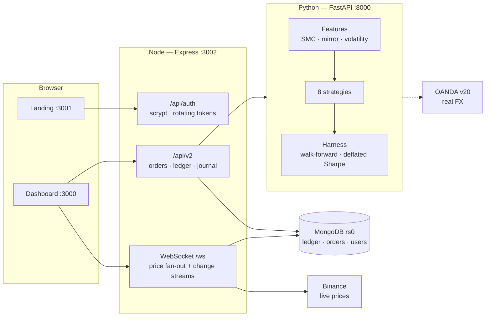

# TradingMitra

A trading platform and a quantitative research harness, built on top of a Zerodha-clone
learning project.

Two things live here, and they are worth separating:

- **A working paper-trading platform** — real authentication, exact decimal money on a
  double-entry ledger, atomic server-priced orders, live market data, and a trade journal.
  Tested, and it works.
- **A research harness that tests trading strategies honestly** — purged walk-forward
  validation, leakage detection, deflated Sharpe ratios. It has been used to test eight
  strategy families across two asset classes.

**The harness says none of those strategies make money.** That result is the most valuable
thing in this repository, and the rest of this README does not try to soften it.

---

## The honest status

| | |
|---|---|
| Platform | Works. 115 automated checks passing. |
| Strategies tested | 8 families, 13 strategy/venue runs, 288 exit variants |
| Strategies with a measured edge | **Zero** — gross expectancy centred on zero, net −0.59R |
| Safe to trade with real money | **No.** See [The research result](#the-research-result). |
| Cost to run everything | ₹0 — every data source and venue used is free |

If you found this repository looking for a profitable Smart Money Concepts bot, the
answer this code produced is that SMC — as a mechanical rule set, on the data tested —
does not produce one. The evidence is in [`quant/`](quant/), it is reproducible in about
ten minutes, and you are welcome to try to break it.

---

## Quick start

Requires Docker, Node 18+, and Python 3.10+.

```bash
git clone https://github.com/Denimworld12/Zerodha_Stock_trading_platform.git
cd Zerodha_Stock_trading_platform

# 1. Backend + database
cd backend && npm install && cp .env.example .env
#    Generate a signing secret and put it in .env as JWT_SECRET:
openssl rand -base64 48

# 2. The quant engine (optional — the app runs without it)
cd .. && python3 -m venv .venv
.venv/bin/pip install -r quant/requirements.txt

# 3. Everything, in one command
./scripts/dev.sh
```

Then open **http://localhost:3000** and create an account. New accounts start with a
funded ₹1,00,000 paper balance.

| Service | URL | What it is |
|---|---|---|
| Dashboard | http://localhost:3000 | The trading UI — sign up here |
| Landing site | http://localhost:3001 | Marketing pages, login/signup |
| API | http://localhost:3002 | Express + WebSocket |
| Signal service | http://localhost:8000/docs | FastAPI, OpenAPI docs |
| MongoDB | localhost:27017 | Docker, single-node replica set |

`./scripts/dev.sh stop` shuts everything down. `./scripts/dev.sh status` shows what is up.
Logs land in `.devlogs/`.

> **MongoDB runs as a replica set, not standalone.** This is not optional: standalone
> MongoDB refuses multi-document transactions, and placing an order writes to an order, a
> position and the ledger at once. Your connection string must carry `?replicaSet=rs0`.

---

## What's inside



| Directory | Contents |
|---|---|
| `backend/lib/` | money, ledger, orders, prices, auth, tokens, journal, runner |
| `backend/models/` | the data model — users, accounts, instruments, ledger, orders, positions |
| `backend/migrations/` | checksummed, locked, ordered schema changes |
| `dashboard/` | trading UI — positions, orders, funds, signals, journal |
| `frontend/` | landing site and auth pages |
| `quant/qsmc/` | features, strategies, labelling, model, backtest, execution |
| `quant/pine/` | TradingView indicator implementing the same SMC rules |
| `scripts/dev.sh` | the one command that runs everything |

---

## The research result

This is the part most trading repositories leave out, so it goes near the top.

### What was tested

Eight strategy families — momentum, mean reversion, mirror pairs, volatility breakout,
volatility regime, cross-sectional rank, session open-range, and SMC — all through the
**same** harness, so the comparison reflects the strategies rather than whose backtest was
written most generously.

| Sample | Instruments | Bars | Period |
|---|---|---|---|
| Crypto | BTC, ETH, SOL, BNB / USDT | 20,000 × 15m | Feb–Sep 2026 |
| Forex | EURUSD, GBPUSD, USDJPY, AUDUSD | 17,240 × 1h | Nov 2023–Sep 2026 |

### The gate, set before the results

```
out-of-sample AUC   >= 0.55     the model can rank setups better than chance
expectancy          >  0        it makes money before leverage
deflated Sharpe     >= 0.95     it survives the number of things we tried
trades              >= 100      it is not three lucky trades
```

**Thirteen strategy/venue runs. None cleared it.** Every AUC landed between 0.438 and
0.536; every expectancy was negative. The best of all of them was −0.205R.

### Four ways it could have been wrong

Each was a specific, testable reason the negative result might be an artefact.

1. **"SMC was implemented badly."** A real bug was found — the premium/discount filter was
   optional, so the system bought at range position 0.58, in *premium*, the exact inverse
   of the concept. Fixed. AUC stayed at **0.4535** against a shuffled-label null of 0.4659.

2. **"The mirror leg was never a real mirror."** Correct, and it mattered. Binance quotes
   everything in USDT, so BTC vs ETH measured **ρ = +0.85** — a hedge pair. EURUSD vs
   USDCHF measured **ρ = −0.7356**, a genuine inverse pair with the mirror regime live on
   94% of bars. Expectancy improved from −0.10R to −0.055R and stayed negative against the
   33.3% break-even win rate.

3. **"SMC is one idea; try others."** Seven more families. Same harness. Same answer.

4. **"They all share one exit, so the exit is the problem."** The sharpest objection, and
   the one that would have invalidated everything above. Entries held fixed, exits swept
   across **288 combinations** of target, stop and holding period on both venues:
   **zero net-positive cells**.

   The distribution is the real answer. *Gross* expectancy — before costs — is centred on
   zero: mean −0.008R, median −0.014R, with half the cells between −0.035R and +0.023R and
   none beyond ±0.11R. *Net* expectancy averages −0.59R. The entries carry no directional
   information at all, and costs do the rest. That is why no exit can rescue them.

### Why the negative is trustworthy

A broken pipeline also returns 0.50, so the harness is controlled:

| Control | AUC | Meaning |
|---|---|---|
| Shuffled labels (null) | 0.4659 | catches leakage — should be ~0.50 |
| Planted 75%-accurate feature (oracle) | **0.7212** | proves the harness finds edges that exist |
| Real features | 0.4535 | indistinguishable from the null |

Reproduce it:

```bash
PYTHONPATH=quant python quant/tests/test_causality.py          # no look-ahead
PYTHONPATH=quant python quant/tests/test_validation_harness.py # null + oracle controls
PYTHONPATH=quant python quant/scripts/run_tournament.py --source fx
PYTHONPATH=quant python quant/scripts/exit_sensitivity.py --source fx
```

### What this does *not* prove

It measures **these rules**, on **these instruments**, at **these timeframes**, over
**these windows**. Untested and still plausible: higher timeframes where structural
definitions have room to mean something, longer history, and discretionary judgement a
fractal rule cannot capture. The FX figures also use free aggregator mid bars — good
enough to detect whether an edge exists, not good enough to price one after spread.

---

## Design decisions that cannot be undone later

These were made deliberately and early, because retrofitting any of them means migrating
every document that already exists.

### Money is never a floating-point number

```js
0.1 + 0.2                    // 0.30000000000000004
// 0.1 added ten times       // 0.9999999999999999
```

Amounts are `BigInt` counts of minor units, stored as MongoDB `Decimal128`. Rounding is
never implicit — every operation that cannot be exact demands an explicit rounding mode,
so a rounding decision is always something a person chose. See
[`backend/lib/money.js`](backend/lib/money.js).

### Balances are derived, not stored

The original code did `fund.availableCash += amount` — a destructive update with no
history. If it was ever wrong, you could not tell when it went wrong or by how much.

Money now moves only by appending balanced double-entry rows, and a balance is the sum of
its entries. Mutating a ledger entry is blocked at the schema level; corrections are
reversing entries. `ledger.audit()` proves debits equal credits and names any unbalanced
transaction.

Because summing a whole ledger is linear in history (30ms at 10k entries, 174ms at 50k,
**681ms at 200k**), balances read from a snapshot plus the entries after its sequence
watermark: **41ms → 3ms** over 10,504 entries. The snapshot is pure derived data and
`rebuildSnapshot()` regenerates it from source, so it can never be the *cause* of a wrong
balance.

### Identity is ours, not the provider's

Auth0 (or Clerk, or Supabase) lives as one entry in `users.identities[]`. Every order,
position and ledger row keys off our own `users._id`. Switching providers is a backfill of
one array instead of rewriting every document that had an `auth0|…` string in it.

Local email + password works today. Adding Auth0 later is two environment variables and
nobody gets signed out — there is a test asserting exactly that.

### Tenancy from the first row

`userId` and `accountId` are required on every document and lead every compound index.
Ownership is proven once in middleware rather than re-remembered in each route, because
"every route remembered to filter by userId" is not a property anyone can maintain.

`npm run test:isolation` registers two real users and proves neither can read, trade,
close or fund the other's account on any path.

### The server prices orders, not the client

The original `POST /order` took `price` from the request body, so anyone could buy at ₹1.
The server now resolves price from its own market feed and **refuses to fill on a quote
older than 5 seconds**. A test sends `price: 1` and asserts the fill came in at market.

---

## Testing

```bash
cd backend
npm test                 # 61 unit tests
npm run e2e              # 27 checks against a running server
npm run test:isolation   # 12 cross-tenant leak checks
node scripts/probe-phase45.js   # 15 journal / runner / WebSocket-auth checks
```

**115 checks total.** Several exist specifically to prove a defect is now impossible
rather than merely unlikely:

- *"a forged price in the body is ignored"* — sends `price: 1`, asserts a market fill
- *"an order beyond the balance leaves nothing behind"* — tries ₹80 lakh on a ₹1 lakh
  account, asserts no order row, no position, cash untouched, audit clean
- *"a sell against an open long CLOSES it rather than opening a short"*
- *"audit detects a hand-corrupted ledger"* — injects ₹10,00,000 of free money, asserts
  the audit catches it
- *"ws refuses someone else's account"*

The quant side has its own controls:

```bash
PYTHONPATH=quant python quant/tests/test_causality.py
```

This truncation-tests every feature column — computed on *N* bars and on *N+k* bars, past
values must be bit-identical — then **self-checks by planting a deliberate look-ahead it
must catch**. A leakage test that cannot detect a leak proves nothing.

---

## Security

### ⚠️ If you forked this before September 2026

`backend/.env` was committed with a working MongoDB Atlas connection string and has been
publicly readable since June 2025. **Rotate that password.** Untracking the file (done on
this branch) stops the next leak; it cannot un-publish the one that already happened.

### What is in place

| | |
|---|---|
| Passwords | scrypt (`N=32768`), memory-hard, zero dependencies, parameters stored per-hash so cost can be raised later |
| Sessions | 15-minute access tokens; refresh tokens SHA-256 hashed, rotated on use, replay revokes the whole family |
| Browser storage | access token in memory only; refresh token in an httpOnly cookie JavaScript cannot read |
| Enumeration | unknown email and wrong password return byte-identical responses; a missing user still pays a dummy hash so timing matches |
| Lockout | stored on the user document, so it survives restarts and applies across instances |
| Transport | helmet, per-route rate limits, CORS locked to an allowlist |
| Orders | idempotency keys enforced by a unique index, not an application check that loses the race |

### Known gaps

- **No password reset.** Needs email delivery, which is a separate decision.
- **Live execution is unbuilt on purpose.** No strategy has cleared its gate, so there is
  nothing worth wiring to a funded account.

---

## Adding a strategy

A strategy answers one question: at the close of each bar, long, short, or flat?

```python
from qsmc.strategies.base import Strategy, StrategyContext, register

@register
class MyIdea(Strategy):
    name = "my_idea"
    thesis = "One sentence. If you cannot write it, it is probably a curve fit."
    timeframes = ("1h", "4h")
    defaults = {"lookback": 48}

    def generate(self, ctx: StrategyContext) -> pd.Series:
        signal = ...  # -1 / 0 / +1, indexed like ctx.bars
        return self._clean(signal, ctx.bars.index)
```

Everything downstream is shared — triple-barrier labelling, purged walk-forward
meta-labelling, the portfolio backtester, the deflated Sharpe. Your idea is judged by the
same harness that found the other eight wanting.

**One rule: `generate` must be causal.** Row `t` may use bars up to and including `t` and
nothing after. Run `quant/tests/test_causality.py` after adding one; it will catch you.

Then:

```bash
PYTHONPATH=quant python quant/scripts/run_tournament.py --source fx --strategies my_idea
```

> `--n-trials` matters. Trying many strategies across venues and timeframes is dozens of
> implicit bets, and the best of dozens of coin flips looks like skill. The deflated Sharpe
> penalises the score by the amount that search was worth.

---

## Roadmap

| Phase | | Status |
|---|---|---|
| 0 | Runs locally | ✅ Met |
| 1 | Trustworthy — auth, tenancy, exact money, ledger | ✅ Met |
| 2 | Free venues connected | ✅ Met |
| 3 | **The edge hunt** | ❌ **Failed** |
| 4 | Journal and autonomous paper runner | ✅ Built |
| 5 | Product surface | ✅ Built |
| 6 | Real capital | 🔒 **Closed** — gated on Phase 3, which failed |

Phase 6 does not open. That is the process working, not the process failing: establishing
that these strategies lose cost a few minutes of compute instead of months and a funded
account.

**Where the value is now:** a backtester with leakage tests, honest confidence intervals
and a deflated Sharpe is worth something whether or not any strategy wins. That is the
product.

---

## Configuration

`backend/.env` — see `.env.example` for the full list.

| Variable | Default | Notes |
|---|---|---|
| `MONGO_URL` | `mongodb://localhost:27017/tradingmitra?replicaSet=rs0` | `?replicaSet=rs0` is required |
| `JWT_SECRET` | — | **Required in production.** `openssl rand -base64 48` |
| `AUTH_DEV_BYPASS` | `false` | Skips auth entirely. Refused when `NODE_ENV=production` |
| `AUTH0_DOMAIN` / `AUTH0_AUDIENCE` | — | Optional. Accepted *alongside* password logins |
| `CORS_ORIGINS` | `localhost:3000,3001` | Comma-separated allowlist |
| `MAX_PRICE_AGE_MS` | `5000` | Older than this and an order is refused, not guessed |
| `FEE_BPS` | `10` | Round-trip cost assumption |
| `QSMC_EXECUTION_ENABLED` | `false` | One of three locks on the autonomous runner |
| `OANDA_API_TOKEN` / `OANDA_ACCOUNT_ID` | — | Free practice account at oanda.com |

---

## Venues and data

Everything used here is free.

| Source | Use | Cost |
|---|---|---|
| Binance public REST + WebSocket | Live crypto prices, historical bars | ₹0 |
| Yahoo Finance chart API | FX history — ~2.8 years hourly, no key | ₹0 |
| OANDA practice | Real FX, unlimited demo, native on Linux | ₹0 |
| MongoDB (Docker → Atlas free tier) | Database | ₹0 |

MetaTrader 5 was evaluated and ruled out for one reason: its Python API is Windows-only,
and this stack runs on Linux. OANDA is plain REST and does the same job.

---

## Acknowledgements and honesty

This began as a Zerodha-clone learning project and the early code shows it — that is
normal and nothing to apologise for. The audit that produced the fixes above found real
defects, and they are documented in the commit messages rather than quietly patched.

One correction worth recording: Sharpe ratios reported during development were inflated
roughly **32×** by an annualisation factor that assumed nanosecond timestamps where pandas
used microseconds. Buy & hold on BTC read 24.86; it is 0.79. Win rates, expectancy in R
and every AUC figure were unaffected, so no conclusion moved — but the numbers were wrong
and are corrected rather than quietly replaced.

---

## Licence and disclaimer

No licence is set; all rights reserved by the repository owner.

**This is not financial advice, and nothing here is a trading recommendation.** Backtested
results do not establish future performance. A strategy that shows no edge in backtest
reliably shows none live. The paper-trading account uses no real money, and no code in
this repository is currently wired to a funded account.
